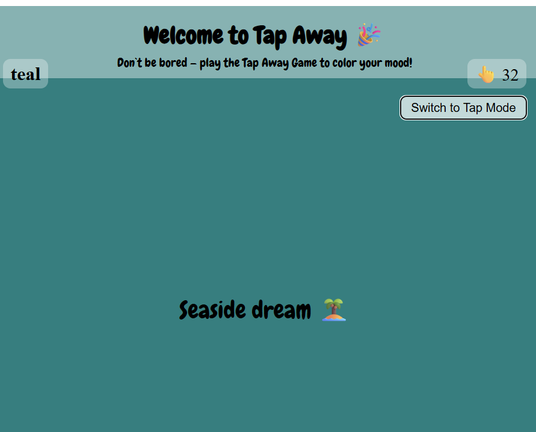
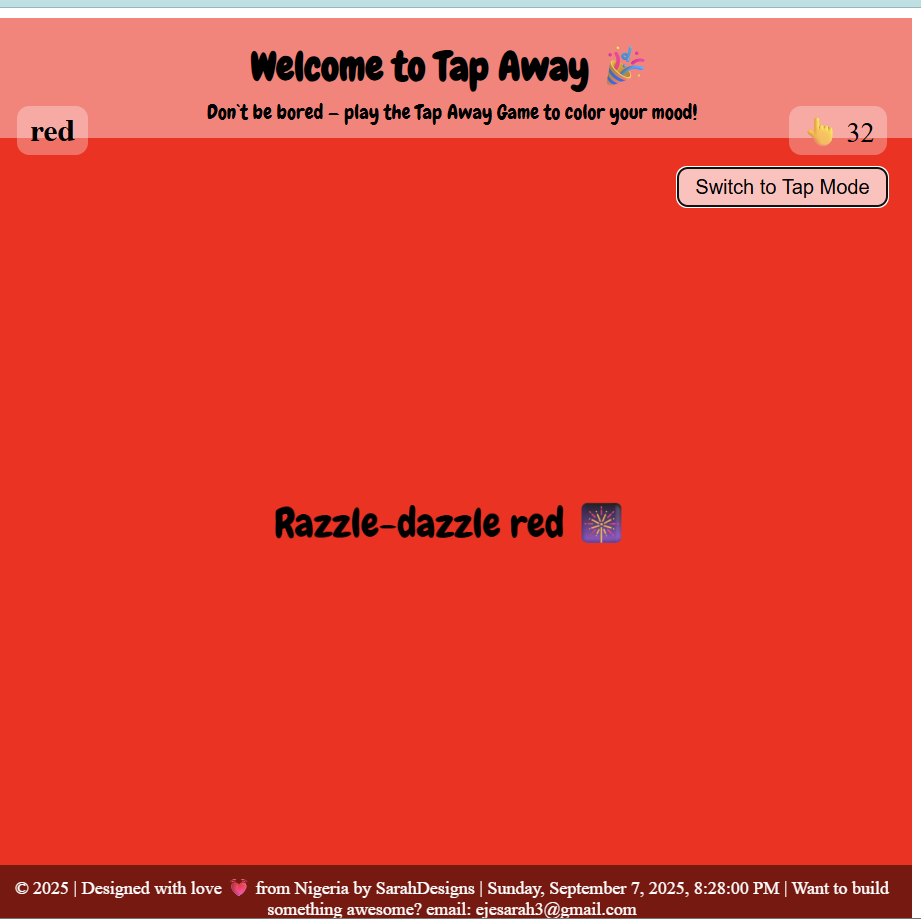
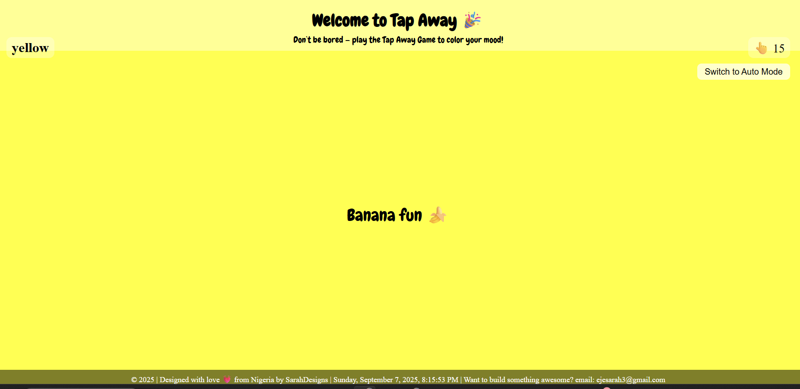

# Tap-Tap Color Game 🎨

Fun, playful web app that changes background colors and displays matching quotes with every tap.

---

## Demo / Live Link

Try the Tap-Tap Game online here: [Live on Vercel](https://your-vercel-url.vercel.app)







You can watch the color and quote changes in action, tap to play, or toggle auto mode!

---

## Description

Tap-Tap Game is a small web app built to practice **DOM manipulation with JavaScript**, arrays, objects, event listeners, and CSS styling.  
It’s designed to be **fun and playful**, with sound effects, milestone messages, and dynamic quotes that align with each color.

---

## Features

- Random background color change on tap
- Sound effect for each tap
- Random quotes that match the color
- Milestone messages after reaching certain tap counts
- Toggle between Tap Mode and Auto Mode
- Dynamic footer showing date, time, and signature
- Smooth animations for quotes (“dance” effect)
- Mystery blend colors using random RGB

---

## Technologies Used

- HTML5
- CSS3 (including Google Fonts)
- JavaScript (DOM manipulation, arrays, objects, event listeners)
- Sound effects via HTML `<audio>`

---

## How It Works

- Colors and quotes are stored as arrays/objects.
- JavaScript functions pick random colors and matching quotes.
- `textContent` updates text elements safely, while `innerHTML` can be used for styled text.
- Event listeners handle tap clicks and toggle auto mode.
- Sound plays on tap and milestones trigger alerts at certain counts.
- Footer updates dynamically every second to show date and time.

---

## Installation / Local Usage

1. Clone this repository:
   ```bash
   git clone https://github.com/yourusername/tap-tap-game.git
   ```
2. Open index.html in your browser to play locally.

Deployment (Vercel)

This project can be hosted easily using Vercel
:

1. Sign in to Vercel and create a new project.

2. Connect your GitHub repository.

3. Vercel will automatically deploy your project.

4. Share the live link in the Demo section above.

Contribution

Feel free to suggest new colors, quotes, or animations by submitting a pull request.

Author / Contact

Sarah Eja Ogbonna
Email: ejesarah3@gmail.com

LinkedIn: [Your LinkedIn Profile]
